# Tattvix Platform Overview

## Purpose

This document defines what Tattvix is, who it serves, and how the main product areas connect. It is a product overview, not an implementation roadmap.

Tattvix is a secure digital hotel check-in platform that lets guests maintain a reusable digital identity profile and share selected information with hotels only after explicit consent. Hotels receive approved guest details instantly through a dashboard, reducing photocopies, manual form filling, WhatsApp document sharing, and repetitive check-in paperwork.

The core promise is:

> One scan. One consent. Instant check-in.

## Product Thesis

Traditional hotel check-in is repetitive for guests and operationally heavy for hotels. Guests repeatedly submit the same identity documents, addresses, signatures, and booking details at every stay. Hotels manually collect, copy, store, and re-enter sensitive information.

Tattvix acts as a trusted bridge between guests and hotels:

1. The guest creates a secure digital profile once.
2. The hotel requests only the information needed for a stay.
3. The guest approves what is shared.
4. The hotel receives the approved details instantly.
5. Every access is logged for privacy, auditability, and compliance.

Tattvix is not just a property management system. It is a consent-driven identity and check-in network for hotels, with hotel operations tools built around that identity-sharing flow.

## Three Portals

Tattvix has three main product surfaces.

| Portal | Primary Users | Main Purpose |
| --- | --- | --- |
| User App | Guests, families, travelers | Store profile, IDs, signature, bookings, consent history, and perform hotel check-in |
| Hotel Owner Dashboard | Owners, managers, reception, housekeeping, security | Manage check-ins, rooms, guests, staff, reports, and hotel operations |
| Super Admin | Tattvix internal team | Approve hotels, monitor platform health, handle disputes, fraud, support, analytics, and revenue |

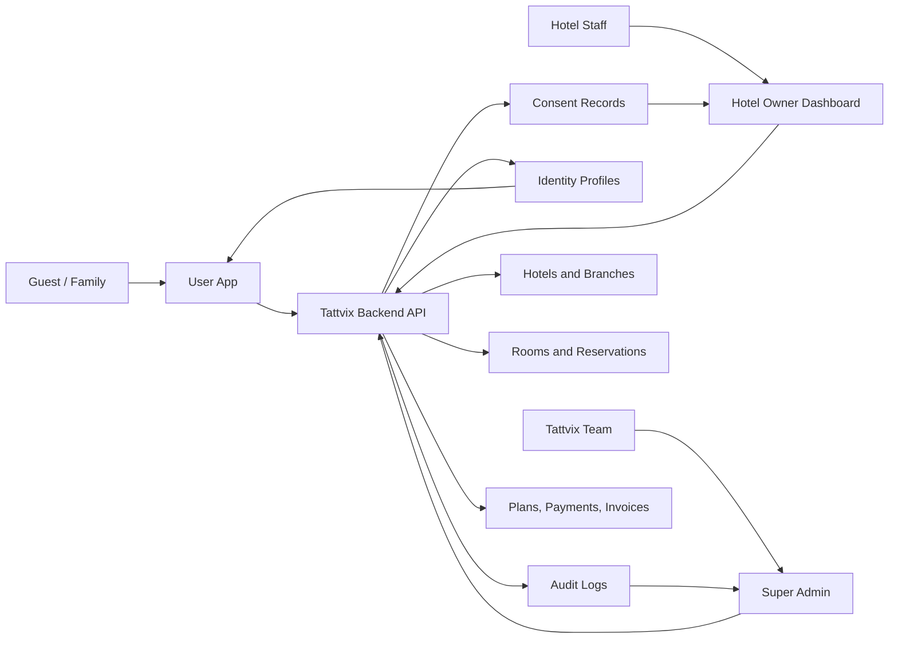

## Core Actors

| Actor | Description |
| --- | --- |
| Guest | A person using Tattvix to check in at hotels and control identity sharing |
| Family Member | A saved person under a guest account, such as spouse, child, parent, friend, or group member |
| Hotel Owner | Person or business that owns one or more hotel properties |
| Hotel Manager | Staff member responsible for property operations |
| Reception Staff | Staff member handling check-in, check-out, walk-ins, and guest verification |
| Housekeeping Staff | Staff member handling room cleaning and readiness status |
| Security Staff | Staff member with limited access to arrival, guest, and verification information |
| Super Admin | Tattvix internal operator managing hotel onboarding, support, fraud, analytics, and disputes |

## End-to-End Guest Flow

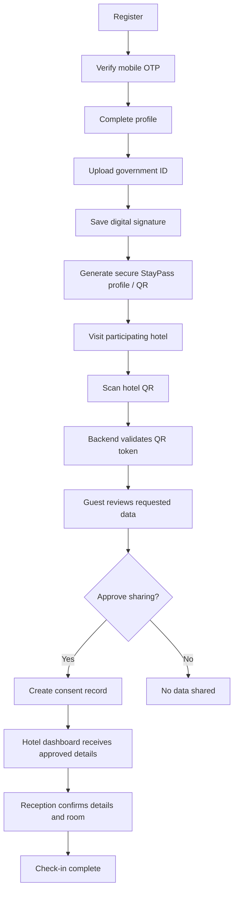

## QR Check-In Flow

Hotel QR codes are the fastest check-in path. A hotel displays a QR code at reception, on a tablet, or inside the dashboard. The user scans the QR through the app, reviews the requested data, and approves sharing.

The hotel QR should contain:

| Field | Purpose |
| --- | --- |
| Hotel ID | Identifies the hotel account |
| Branch ID | Identifies the specific property or branch |
| Random Token | Prevents predictable or reusable QR access |
| Expiry | Limits QR validity window |
| Digital Signature | Lets the backend verify the QR was generated by Tattvix |

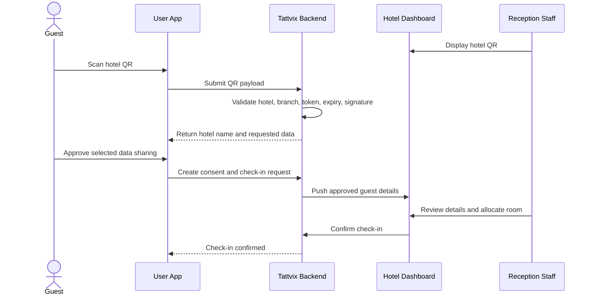

## Consent and Privacy Model

Consent is a core product primitive. Hotels should never receive unrestricted guest information by default.

Guests can choose to share:

| Share Option | Example Data |
| --- | --- |
| Name only | Full name |
| Identity document | Aadhaar, passport, driving license, voter ID, or selected ID |
| Address | Home or current address |
| Booking | Booking reference, dates, source |
| Vehicle | Vehicle number or travel details, if required |
| Signature | Saved digital signature |
| Emergency contact | Name and phone number |
| Everything | Complete hotel-required profile |

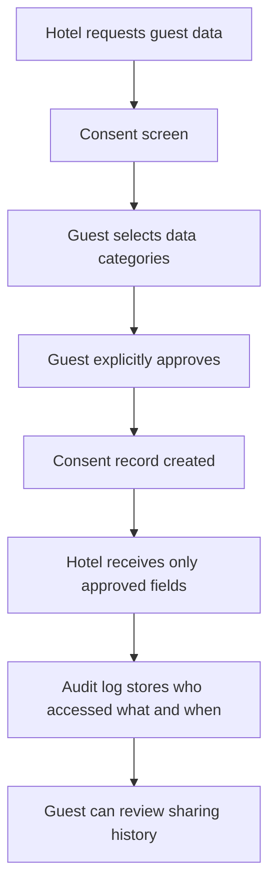

## Platform Modules

| Module | Responsibility |
| --- | --- |
| Authentication | Mobile OTP, email login, Google login, Apple login, sessions, account security |
| Profile | Guest personal details, address, nationality, emergency contact, profile completion |
| Government IDs | Multiple ID documents, front/back upload, manual edit, expiry reminders, verification badge |
| Family Members | Separate profiles and IDs for spouse, kids, parents, friends, or group members |
| Digital Signature | Capture and store user signature for hotel check-in forms |
| Hotels | Hotel registration, GST, license, manager details, branches, verification status |
| Rooms | Floors, rooms, room types, room status, cleaning, maintenance, occupancy |
| Booking | Manual bookings, imports, future OTA integrations |
| Check-in | QR check-in, walk-in flow, room allocation, guest approval, reception confirmation |
| Checkout | Invoice generation, payment, feedback, room cleaning status |
| Consent | Per-hotel, per-stay approval and data sharing scope |
| QR | Hotel QR generation, validation, expiry, random tokens, signatures |
| OCR | Future document extraction and manual correction workflow |
| Notifications | Booking, check-in, check-out, invoice, ID expiry, offers, hotel alerts |
| Payments | Hotel subscription billing, guest invoices, checkout payments |
| Reports | Occupancy, revenue, average stay, guest source, daily/weekly/monthly reports |
| Audit Logs | Track data access, consent, staff actions, and compliance events |
| Support | Support tickets, disputes, fraud review, admin intervention |

## Guest App

The User App is for guests and families. It is the place where travelers create a reusable identity profile and approve hotel data sharing.

### Guest App Home

Expected home sections:

```text
Hello Rahul

Your StayPass ID
QR Code
Quick Check-in
Bookings
Family
Documents
Nearby Hotels
History
```

### Guest Profile

Basic details:

| Field | Notes |
| --- | --- |
| Name | Guest legal or preferred name |
| Date of birth | Required for hotel records where applicable |
| Gender | Optional or jurisdiction-dependent |
| Nationality | Useful for domestic and foreign guest records |
| Address | Used for hotel registration records |
| Emergency contact | Used by hotels during stay-related issues |

### Government IDs

Guests can store multiple identity documents:

| ID Type | Notes |
| --- | --- |
| Aadhaar | India-specific identity document |
| Passport | Required for foreign guests and international travel |
| Driving License | Common government ID |
| Voter ID | Common government ID |
| Selfie | Future verification and profile trust |
| Address Proof | If separate from primary ID |
| Mobile | Verified phone number |
| Emergency Contact | Linked to profile and check-in |

ID features:

- Front and back upload.
- Manual edit of extracted details.
- OCR extraction later.
- Expiry reminder.
- Verified badge later.
- User chooses which ID to share per hotel.

### Family Members

Users can save separate profiles and ID documents for family or group members:

- Wife or spouse.
- Kids.
- Parents.
- Friends.
- Group travelers.

This enables one guest account to check in an entire family or group together while preserving separate identity records for each person.

### Guest Booking History and Wallet

The user should be able to view:

- Previous hotels.
- Check-in history.
- Check-out history.
- Invoices.
- Bills.
- Receipts.
- GST invoices.
- Travel history export later.

### Guest Notifications

Guest-facing notifications include:

- Booking confirmed.
- Checked in.
- Checked out.
- Invoice ready.
- ID expiring.
- Offers.

## Hotel Owner Dashboard

The Hotel Owner Dashboard is the operational center for hotels. It should work well on web and tablet because reception and hotel managers may use it at the front desk.

Expected dashboard summary:

```text
----------------------------------
StayPass

Today's Check-ins : 24

Occupied : 68

Vacant : 32

Revenue : INR 1.25L

----------------------------------

Upcoming Guests

Current Guests

Walk-in

Rooms

Reports

Staff

Settings
```

### Dashboard Metrics

| Metric | Description |
| --- | --- |
| Today's check-ins | Guests expected or completed today |
| Current guests | Guests currently staying |
| Today's checkout | Guests due to leave today |
| Occupancy | Percentage or count of occupied rooms |
| Vacancy | Available room count |
| Revenue | Daily, monthly, or selected-period revenue |
| Pending verification | Hotels, guests, IDs, or check-ins needing review |

### Reservations

Reservation workspace should support:

- Search.
- Upcoming guests.
- Cancelled bookings.
- Walk-ins.
- No-shows.
- Manual bookings.
- Future imported bookings.

Future booking integrations:

- Booking.com.
- MakeMyTrip.
- Goibibo.
- Agoda.

### Walk-In Guest Flow

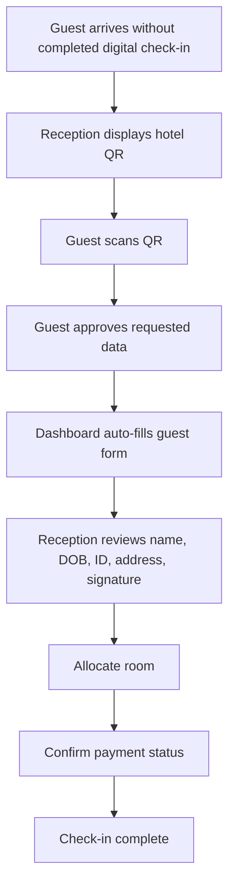

### Current Guests

Current guest list should show:

| Field | Description |
| --- | --- |
| Room | Assigned room number |
| Guest | Primary guest name |
| Check-in time | When stay began |
| Days stayed | Current stay length |
| Status | Active, checkout due, payment pending, issue flagged |

### Room Management

Room management includes:

- Floors.
- Rooms.
- Room type.
- Room status.
- Occupied.
- Vacant.
- Cleaning.
- Maintenance.
- Reserved.

Live occupancy example:

```text
100 Rooms
68 Occupied
20 Vacant
5 Cleaning
7 Reserved
```

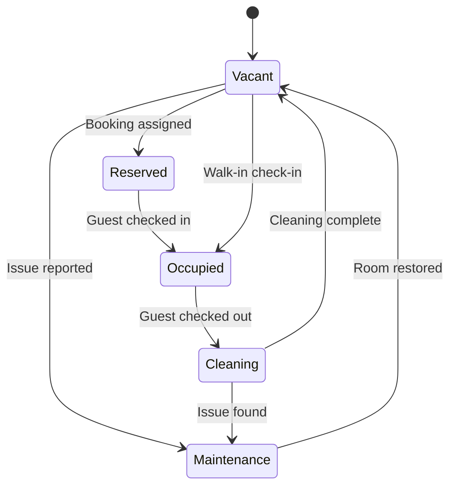

### Check-In Screen

The hotel check-in screen should show:

- Guest details.
- Government ID.
- Signature.
- Photo.
- Room allocation.
- Payment status.
- Special notes.
- Consent scope.
- Staff action history.

### Check-Out Flow

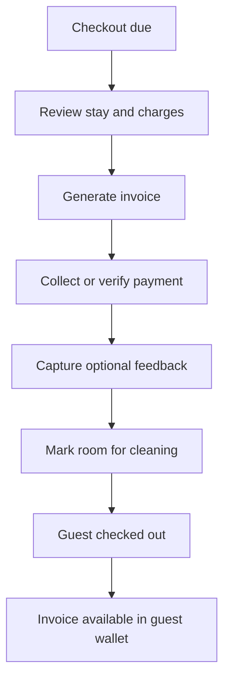

### Housekeeping

Housekeeping workflow:

- Assign cleaning.
- Complete cleaning.
- Mark room ready.
- Report maintenance.
- Notify reception when room is ready.

### Guest History

Hotel guest history can include:

- Previous visits.
- Complaints.
- Preferences.
- VIP flag.
- Blacklist flag.

Access to guest history should respect hotel-specific consent, legal retention rules, and internal staff permissions.

### Staff Management

Staff roles:

| Role | Example Permissions |
| --- | --- |
| Owner | Full property and billing access |
| Manager | Operations, reports, staff, settings |
| Reception | Check-in, checkout, guest search, room allocation |
| Housekeeping | Room cleaning and readiness |
| Security | Limited guest arrival and verification visibility |

### Hotel Notifications

Hotel-facing notifications include:

- Guest arrived.
- Payment pending.
- Checkout due.
- ID missing.
- Room ready.
- Verification pending.

### Multi-Hotel Owner Support

Owners may operate multiple hotels or branches:

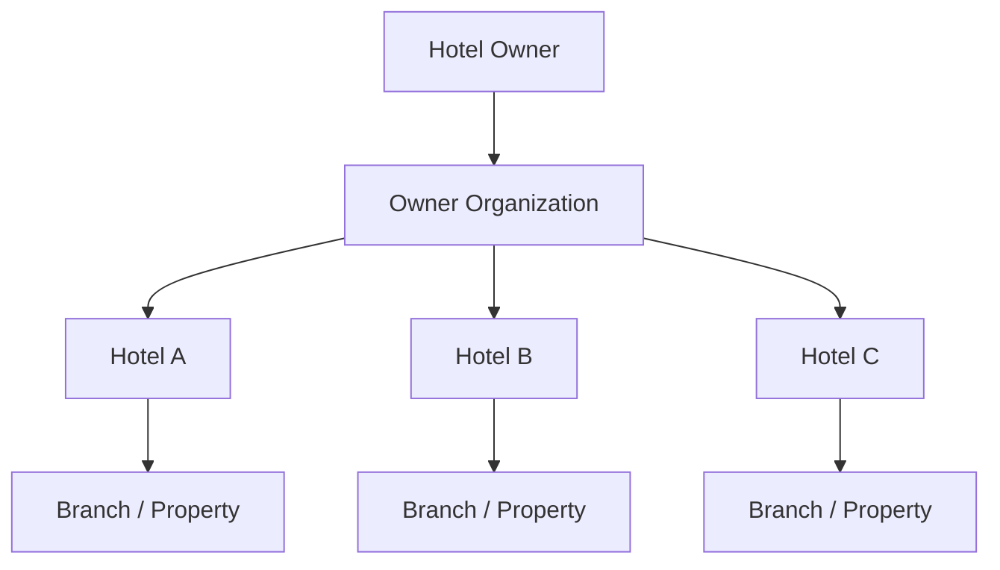

The dashboard should allow owners and authorized managers to switch between properties.

## Super Admin

The Super Admin portal is for internal Tattvix operations.

Primary capabilities:

- Approve and onboard hotels.
- Review GST, license, and manager details.
- Block hotels.
- View analytics.
- View user information when permitted.
- Monitor revenue.
- Handle disputes.
- Review fraud signals.
- Manage support tickets.
- Investigate audit logs.

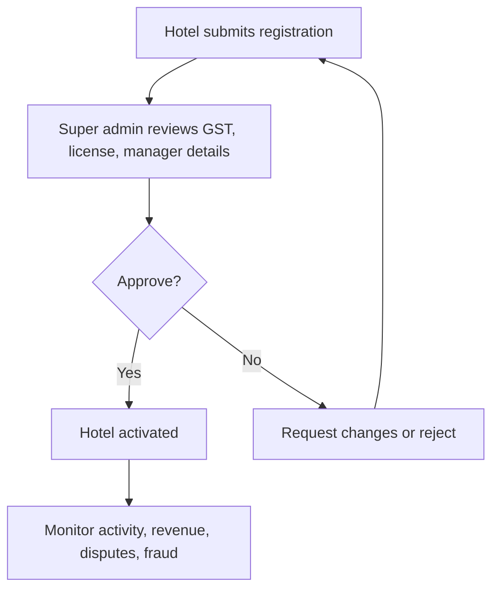

## Conceptual Data Model

This is a product-level model. It is not a final database schema.

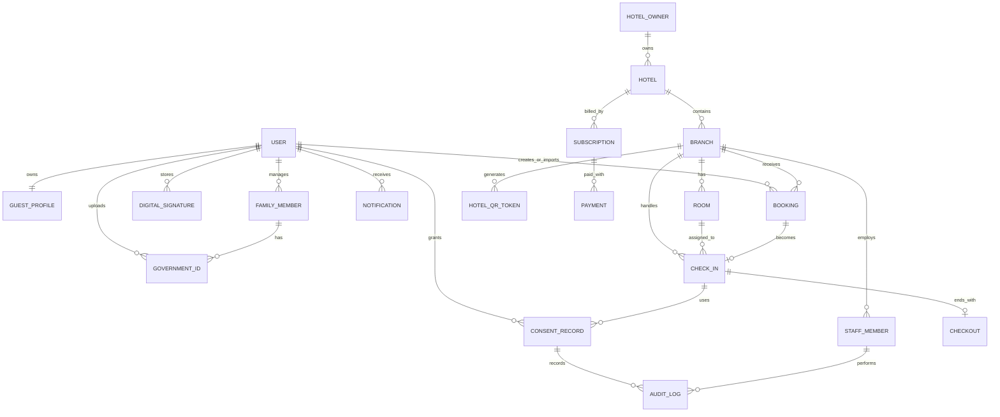

## High-Level System Responsibilities

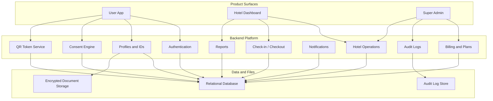

## Business Model

### Hotels

| Plan | Price | Scope |
| --- | --- | --- |
| Free Tier | Free | Up to 20 check-ins/month, basic dashboard |
| Starter | INR 999/month | Single property, unlimited check-ins, room management |
| Professional | INR 2,999/month | Multi-user, multi-hotel, reports, occupancy analytics, invoice generation |
| Enterprise | Custom | Multi-property chains, API access, integrations, dedicated support |

### Users

| Plan | Price | Scope |
| --- | --- | --- |
| Free | Free forever | Core profile, check-in, consent, and basic document use |
| Premium | Optional | Cloud document vault, travel history export, family sharing, travel insurance offers |

## Legal, Privacy, and Compliance Requirements

These requirements should be validated with legal counsel before launch.

- Take explicit user consent every time data is shared with a hotel.
- Encrypt sensitive documents at rest and in transit.
- Maintain an audit log of which hotel accessed which data and when.
- Show hotels only the required guest information.
- Hide unnecessary personal data by default.
- Support configurable data retention policies.
- Balance hotel guest record obligations with user privacy.
- Account for Indian privacy expectations, including the Digital Personal Data Protection Act, 2023.
- Prepare for hotel guest record requirements such as local guest registers and future police verification workflows.

## Future Capabilities

Future or post-MVP capabilities mentioned in the product notes:

- Government ID verification badge.
- OCR-based document extraction.
- NFC check-in.
- Booking.com integration.
- MakeMyTrip integration.
- Goibibo integration.
- Agoda integration.
- Police verification automation.
- C Form generation.
- Local guest register generation.
- Fraud detection.
- API access for enterprise hotel chains.
- Travel insurance offers.

## Key Product Principles

1. Consent first: no hotel receives data without explicit user approval.
2. Minimum necessary sharing: hotels see only the fields needed for the current stay.
3. Reusable identity: guests should not repeatedly upload the same documents.
4. Fast reception workflow: check-in should be measured in seconds, not minutes.
5. Auditability: sensitive actions must leave a trace.
6. Multi-property ready: the owner dashboard should support single hotels and chains.
7. Mobile-first for guests: the guest experience should be quick, clear, and trust-building.
8. Tablet-friendly for hotels: reception workflows should work well on front-desk tablets.
9. Compliance-aware: data retention, guest records, and privacy choices must be built into the platform.
10. Operationally useful: rooms, occupancy, checkout, housekeeping, reports, and staff permissions matter because they close the hotel workflow after identity sharing.

## Current Product Boundary

The full vision includes identity, hotel operations, payments, reports, integrations, and compliance workflows. For future planning, the first build plan should separate:

- Core identity and consent.
- Core hotel onboarding.
- QR check-in.
- Basic hotel dashboard.
- Room and reservation operations.
- Payments and reports.
- Advanced verification, integrations, and automation.

That sequencing should be handled in a separate roadmap document.
